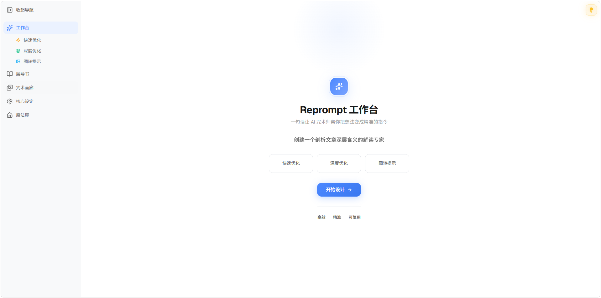

<div align="center">

# Reprompt Atelier 🪄 重提示工坊

*Prompts are spells. Welcome to the prompt engineering atelier.*  
*提示即咒语，欢迎来到提示词工程魔法工坊！*



</div>

**Reprompt** — Turn a rough idea into a sharper prompt. Choose a fast pass, a three-specialist forge, or image-to-prompt.  
**工作台** — 把一个粗糙想法锻造成更锋利的提示词。想快一点、想让三位术师协作，或者想从图里反推提示词，都行。

**Grimoire** — The complete craft of prompting, mapped across 15 chapters and 133 pages.  
**魔导书** — 提示词工程的完整知识体系，15 章、133 页，我是真的试图教会你（笑）。

**Gallery** — A curated waterfall display of nearly 100 artworks, with every prompt fully exposed. Steal the incantation, learn the craft.  
**咒术画廊** — 精选近百件艺术作品以瀑布流展示，对应的提示词也毫无保留地呈现给你，实践出真知，想复现可直接带走。

If the demo caught your eye, leave the project a ⭐, then 👉 **[Try it now](https://reprompt-atelier.netlify.app/)**.  
如果你看到效果图心动了，请给本项目点个⭐，赶紧点击 👉 **[立即体验](https://reprompt-atelier.netlify.app/)** 叭！

---

## Features / 功能模块

### 🔧 Workspace / 工作台

**Quick Optimize** — One agent, three-step reasoning (analyze intent → break down → synthesize). Fast results.  
**快速优化** — 单一智能体，三阶段推理（分析意图 → 拆解任务 → 合成提示）。快速生成你需要的咒语。

**Deep Optimize** — Three specialists work in sequence:  
**深度优化** — 三位术师顺序协作：

- **Analyzer** dissects your prompt — what's the goal? what's missing?  
  **意图分析师**剖析你的想法：目标是什么？缺少什么？

- **Planner** designs improvements — add this, remove that, clarify here  
  **任务调度官**设计改进方案：添加这个、删除那个、澄清细节

- **Synthesizer** rewrites it into production-ready form  
  **咒术合成者**将三路输入熔铸成可直接使用的最终咒语

Watch them think. Hit stop whenever you want. Local session history stays in your browser.  
全程旁观它们如何思考，可以随时喊停。本地会话记录保存在浏览器中。

**Image to Prompt** — Upload an AI image, vision model reverse-engineers the prompt.  
**图转提示** — 上传一张 AI 图片，用视觉语言模型反推出提示词。

### 📖 Grimoire / 魔导书

Complete prompt engineering knowledge base translated from [promptingguide.ai](https://www.promptingguide.ai):  
从 [promptingguide.ai](https://www.promptingguide.ai) 翻译的完整提示词工程知识库：

- 15 chapters, 93 sections, 133 pages, 137 illustrations  
  15 个章节、93 个小节、133 页、137 张插图

- Prompt Hub: 12 categories, 24 practical examples (classification, Q&A, reasoning, creative tasks)  
  Prompt Hub：12 个分类、24 个实用案例（分类、问答、推理、创意任务）

- LLM Collection: 20 model guides (GPT, Claude, Gemini, LLaMA, etc.)  
  LLM Collection：20 个模型指南（GPT、Claude、Gemini、LLaMA 等等）

Three-level navigation, reading progress tracking, searchable content.  
三级导航、阅读进度追踪、可搜索内容。

### 🎨 Gallery / 咒术画廊

Nearly 100 AI artworks and complete prompts, from:
近百件 AI 作品及完整提示词，来自：

- GPT Image 2  
- Nano Banana Pro  
- Seedream 4.5  
- Seedream 5.0 Lite  

Masonry waterfall layout. Filter by model. Click to view in cinematic lightbox. Copy prompts instantly.  
瀑布流布局，可按模型筛选作品。点击图片即可在电影级灯箱中查看高清原图，还能一键复制随手带走你心仪的提示词。

### ⚙️ Settings / 核心设定

Each mode gets its own brain and personality. Enter an OpenAI-compatible API endpoint, key, and model, then test the connection — done.  
每种模式都配有独立的大脑和人格。填入兼容 OpenAI 的 API 地址、密钥与模型名称，测下连通就完事儿啦。

Your agents, your rules: shape their system prompts or roll with the defaults.  
你的智能体由你来定人格，可以随意修改他们的系统提示词，或者直接用我的默认设定。

Everything stays on your machine. We never see your keys. Requests go directly to the API endpoint you configure.  
一切留在你的机器上。我们看不到你的密钥。请求只会直接发往你自行配置的 API 端点。

---

## Quick Start / 本地部署跑起来

**Prerequisites / 前置要求**

Node.js 18+ and access to an OpenAI-compatible API  
Node.js 18+，以及可用的 OpenAI 兼容 API 服务

**Install & Run / 安装与运行**

```bash
git clone https://github.com/ShiuKimBlue/reprompt-atelier.git
cd reprompt-atelier
npm install
npm run dev
```

Open http://localhost:5173  
打开 http://localhost:5173

**Configure / 配置**

1. Go to Settings → enter an OpenAI-compatible API endpoint, key, and model  
   进入核心设定 → 填入兼容 OpenAI 的 API 地址、密钥与模型名称

2. Select models for Quick / Deep / Image modes  
   为快速 / 深度 / 图片模式选择模型

3. Test connectivity  
   测试连通性

4. Return to Workspace and start optimizing  
   返回工作台开始优化

---

## Build / 构建

```bash
npm run build    # Production build / 生产构建
npm run preview  # Preview build / 预览构建
npm run lint     # Check code / 代码检查
```

Output in `dist/` directory, ready for static hosting (Netlify, Vercel, Cloudflare Pages).  
输出在 `dist/` 目录，可部署到任何静态托管服务（Netlify、Vercel、Cloudflare Pages）。

---

## Tech Stack / 技术栈

- **React 19** + **TypeScript 6** — strict mode, modern patterns  
- **Vite 8** — lightning-fast dev & build  
- **Tailwind CSS v4** — CSS-first with custom properties (no config file)  
- **shadcn/ui** (base-ui) — accessible components  
- **LangChain.js v1.5** — multi-agent orchestration, streaming events v3 API  
- **Zustand** — state management with localStorage persistence  
- **react-markdown** + **remark-gfm** — GitHub-flavored markdown  

---

## How Deep Optimize Works / 深度优化工作原理

When you click "Run Deep Optimize":  
当你点击"运行深度优化"时：

1. **Analyzer** reads your prompt and breaks it down:  
   **意图分析师**阅读你的提示词并拆解：
   - What's the intent? What's missing? What's unclear?  
     意图是什么？缺少什么？哪里不清楚？

2. **Planner** reviews the analysis and designs improvements:  
   **任务调度官**审查分析并设计改进：
   - Add context here. Remove ambiguity there. Reorder for clarity.  
     这里添加上下文，那里消除歧义。重新排序，提高清晰度。

3. **Synthesizer** executes the plan and rewrites:  
   **咒术合成者**执行计划并重写：
   - Outputs a refined, production-ready prompt.  
     输出一个精炼的、可直接使用的提示词。

All agents stream their reasoning in real-time (if enabled). You see how they think.  
所有智能体实时流式输出它们的推理过程（如果启用的话），你能看到它们如何思考。

---

## Project Map / 项目地图

```
src/
├── components/
│   ├── reprompt/      # Workspace (Quick/Deep/Image modes)
│   ├── grimoire/      # Knowledge base
│   ├── gallery/       # AI artwork gallery
│   ├── settings/      # API & persona config
│   ├── github/        # Open source credits
│   └── ui/            # shadcn/ui components
├── stores/            # Zustand state (4 stores)
├── data/
│   ├── gallery/       # 56 artworks metadata
│   └── grimoire/      # Knowledge base index
└── lib/               # LangChain agents, utilities

public/
├── data/grimoire/chapters/  # 133 pages
└── images/
    ├── gallery/             # 56 artworks
    └── grimoire/            # 137 illustrations
```

---

## Privacy & Local-First / 隐私与本地优先

Your stuff is yours. This app has no backend, no database, no analytics — everything in your browser stays in your browser.  
你的东西归你所有。这个应用没有后端、没有数据库、没有分析 — 浏览器里的东西就留在浏览器里。

The only thing that leaves your machine is a direct request to the API endpoint you configure. We never see your prompts, your images, or your keys.  
唯一离开你机器的内容，是发往你自行配置 API 端点的直接请求。我们看不到你的提示词、图片或密钥。

Uploaded images (Image to Prompt) are forgotten the moment you close the tab. We only remember their names to show in history.  
上传的图片（图转提示）在你关掉标签页的瞬间就被遗忘。我们只记住文件名，但仅在历史记录里显示。

---


## Roadmap / 路线图

We're building toward a future where prompts are living assets — not disposable text.  
我们朝向一个未来打造：提示词是可传承的资产，不是一次性的字串。

- **Iterative optimization** — loop the output back to Planner and refine again. And again. Until it's perfect.  
  **循环迭代** — 把输出送回任务调度官，再打磨一遍。一遍又一遍。直到完美。

- **Prompt asset library** — collect your best spells, compare versions, fork new ones from old favorites.  
  **提示词资产库** — 收藏你的最佳咒文，比对版本，从心头好里派生新变种。

- **Wizard's intervention** — step in at Planner stage. Tweak the plan before the synthesizer casts the final spell.  
  **术师介入** — 在任务调度官阶段亲手介入，在咒术合成者交出最终咒文之前微调方案。

- **Training ground** — the Grimoire grows exercises. Practice prompt engineering by doing, not just reading.  
  **训练场** — 魔导书会生长出练习题。通过动手练来学提示词工程，不只是用读的。

- **Gallery → Workspace bridge** — steal a spell from the gallery, drop it into the forge. Refine someone else's craft into your own.  
  **画廊 → 工作台直通** — 从咒术画廊偷一道咒文，丢进锻造炉。把别人的手艺精炼成你自己的。

---

## Contributing / 贡献

Contributions welcome! Report bugs, suggest features, improve docs, or submit PRs.  
欢迎贡献！报告 bug、建议功能、改进文档或提交 PR。

Before submitting code:  
提交代码前：

```bash
npm run lint   # Must pass 0/0
npm run build  # Must complete
```

---

## Credits / 致谢

[Prompt Engineering Guide](https://github.com/dair-ai/Prompt-Engineering-Guide) · [React](https://github.com/facebook/react) · [TypeScript](https://github.com/microsoft/TypeScript) · [Vite](https://github.com/vitejs/vite) · [Tailwind CSS](https://github.com/tailwindlabs/tailwindcss) · [LangChain.js](https://github.com/langchain-ai/langchainjs) · [shadcn/ui](https://github.com/shadcn-ui/ui) · [Zustand](https://github.com/pmndrs/zustand) · [react-markdown](https://github.com/remarkjs/react-markdown) · [Lucide](https://github.com/lucide-icons/lucide)

---

## License / 许可证

MIT License. See [LICENSE](LICENSE). Open source forever—just keep the attribution.  
MIT 许可证。详见 [LICENSE](LICENSE)。开源万岁，署名即可。

---

<div align="center">

*Reprompt · Refine · Reveal*

</div>